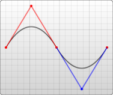

**可缩放矢量图形**（Scalable Vector Graphics，SVG）, 是一种`XML语言`，用于描述二维的矢量图形。

<!--more-->


## 什么是 SVG

**可缩放矢量图形**（**Scalable Vector Graphics，SVG**）, 是一种`XML语言`，用于描述二维的矢量图形。SVG 可以通过定义必要的线和形状来创建一个图形，也可以修改已有的位图，或者将这两种方式结合起来创建图形。图形和其组成部分可以形变（be transformed）、合成、或者通过滤镜完全改变外观。

SVG 诞生于 1999 年，主流浏览器均支持 SVG。加载慢是 SVG 的一个缺点。但是 SVG 也有自身的优点，比如它实现了 DOM 接口（比 Canvas 方便）

> 1. SVG 图形可以在各种设备和平台上显示，包括计算机、移动设备和打印机等。它是基于开放标准的矢量图形格式，被广泛支持和使用。
> 2. 和传统的点阵图像（位图）模式不同的是，SVG 格式提供的是矢量图，这意味着它的图像能够被无限放大而不失真或降低质量，并且可以方便地修改内容，无需图形编辑器。通过使用合适的库进行配合，SVG 文件甚至可以随时进行本地化。
> 3. 相比于位图图形，SVG 图形文件通常更小，因为它们使用了数学公式来描述图形而不是保存每个像素。这使得 SVG 在网络上的传输速度更快，加载更快。
> 4. SVG 支持动画和交互性，可以使用 CSS 和 JavaScript 来实现各种效果，例如淡入淡出、旋转、缩放、鼠标悬停效果等，为用户提供更丰富的视觉和交互体验。

## 概念

### 坐标系

对于所有元素，SVG 使用的坐标系统或者说网格系统，和 Canvas 用的差不多（所有计算机绘图都差不多）。这种坐标系统是：以页面的左上角为 (0,0) 坐标点，坐标以像素为单位，x 轴正方向是向右，y 轴正方向是向下。


#### SVG 嵌在 SVG 内部

比之 HTML，SVG 允许你无缝嵌入别的 svg 元素。因此你可以利用内部`svg`元素的属性`viewBox`、属性`width`和属性`height`简单创建一个新的坐标系统。

XMLCopy to Clipboard

```xml
<svg xmlns="http://www.w3.org/2000/svg" version="1.1">
  <svg width="100" height="100" viewBox="0 0 50 50">
    <rect width="50" height="50" />
  </svg>
</svg>
```

以上示例基本上跟它上面的示例有同样的效果，也就是矩形将是指定的两倍大。

### 元素

#### 矩形：rect

```xml
<rect x="10" y="10" width="30" height="30"/>
<rect x="60" y="10" rx="10" ry="10" width="30" height="30"/>
```

x

矩形左上角的 x 位置

y

矩形左上角的 y 位置

width

矩形的宽度

height

矩形的高度

rx

圆角的 x 方位的半径

ry

圆角的 y 方位的半径

#### 圆形：circle

```xml
<circle cx="25" cy="75" r="20"/>
```

- r

  圆的半径

- cx

  圆心的 x 位置

- cy

  圆心的 y 位置

#### 椭圆：ellipse

Ellipse 是 circle 元素更通用的形式，你可以分别缩放圆的 x 半径和 y 半径（通常数学家称之为长轴半径和短轴半径）。

```xml
<ellipse cx="75" cy="75" rx="20" ry="5"/>
```

- rx

  椭圆的 x 半径

- ry

  椭圆的 y 半径

- cx

  椭圆中心的 x 位置

- cy

  椭圆中心的 y 位置

#### 线：line

Line 绘制直线。它取两个点的位置作为属性，指定这条线的起点和终点位置。

```xml
<line x1="10" x2="50" y1="110" y2="150" stroke="black" stroke-width="5"/>
```

- x1

  起点的 x 位置

- y1

  起点的 y 位置

- x2

  终点的 x 位置

- y2

  终点的 y 位置

#### 折线：Polyline

Polyline 是一组连接在一起的直线。因为它可以有很多的点，折线的的所有点位置都放在一个 points 属性中：

```xml
<polyline points="60, 110 65, 120 70, 115 75, 130 80, 125 85, 140 90, 135 95, 150 100, 145"/>
```

> 在 SVG 中，points 用于指定一系列点的位置。每个点由其 x 和 y 坐标组成，并且多个点之间使用空格或逗号进行分隔。以下是几种常见的格式：
>
> 1. 使用空格分隔的坐标对：`x1,y1 x2,y2 x3,y3 ...`，例如：`100,50 200,100 300,150`
> 2. 使用逗号分隔的坐标对：`x1,y1, x2,y2, x3,y3, ...`，例如：`100,50, 200,100, 300,150`
> 3. 直接连续写出所有 x 和 y 值：`x1 y1 x2 y2 x3 y3 ...`，例如：`100 50 200 100 300 150`

#### 多边形：polygon

polygon 和折线很像，它们都是由连接一组点集的直线构成。不同的是，polygon 的路径在最后一个点处自动回到第一个点。需要注意的是，矩形也是一种多边形，如果需要更多灵活性的话，你也可以用多边形创建一个矩形。

```xml
<polygon points="50, 160 55, 180 70, 180 60, 190 65, 205 50, 195 35, 205 40, 190 30, 180 45, 180"/>
```

#### 路径：path

path 可能是 SVG 中最常见的形状。你可以用 path 元素绘制矩形（直角矩形或者圆角矩形）、圆形、椭圆、折线形、多边形，以及一些其他的形状，例如贝塞尔曲线、2 次曲线等曲线。

> 每一个命令都有两种表示方式，一种是用**大写字母**，表示采用绝对定位。另一种是用**小写字母**，表示采用相对定位

##### 坐标移动：M/m

`Move to`命令

M 命令仅仅是移动画笔，但不画线。

```
M x y
(or)
m dx dy
```

##### 直线绘制

L/l：`Line to`命令

L 命令将会在当前位置和新位置（L 前面画笔所在的点）之间画一条线段

```
L x y
(or)
l dx dy
```

H/h：绘制水平线。

V/v：绘制垂直线。

```
H x
(or)
h dx
V y
(or)
v dy
```

##### 绘制曲线

###### 三次贝塞尔曲线：C/c

```
C x1 y1, x2 y2, x y
(or)
c dx1 dy1, dx2 dy2, dx dy
```


- x1, y1：起点控制点
- x2, y2：终点控制点
- x, y：终点

###### 省略起点控制点的三塞尔曲线：S/s

S 命令起点控制点：前一条是`C或者S曲线`，`终点的控制点`对于终点的中心对称点；前一条不是曲线，起点直接作为控制点

```
S x2 y2, x y
(or)
s dx2 dy2, dx dy
```


```xml
<svg width="190" height="160" xmlns="http://www.w3.org/2000/svg">
  <path d="M 10 80 C 40 10, 65 10, 95 80 S 150 150, 180 80" stroke="black" fill="transparent"/>
</svg>
```

###### 二次贝塞尔曲线：Q/q

```
Q x1 y1, x y
(or)
q dx1 dy1, dx dy
```


- x1, y1：控制点
- x, y：终点

###### 省略控制点的二次贝塞尔曲线：T/t

T 命令起点控制点：前一条是`Q或T命令`，`终点的控制点`对于终点的中心对称点；前一条不是曲线，起点直接作为控制点



##### 弧形：A/a

弧形命令实际根据两点截取椭圆的一段路径

已知椭圆形的长轴半径和短轴半径，并且已知两个点（在椭圆上），根据半径和两点，可以画出两个椭圆


```
 A rx ry x-axis-rotation large-arc-flag sweep-flag x y
 a rx ry x-axis-rotation large-arc-flag sweep-flag dx dy
```

rx：椭圆的 x 半径

ry：椭圆的 y 半径

x-axis-rotation：椭圆的 x 轴旋转角度

large-arc-flag：决定弧线是大于还是小于 180 度，0 表示小角度弧，1 表示大角度弧

sweep-flag：表示弧线的方向，0 表示从起点到终点沿逆时针画弧，1 表示从起点到终点沿顺时针画弧

x：终点 x 坐标

y：终点 y 坐标

```xml
<svg xmlns="http://www.w3.org/2000/svg" width="320" height="320">
  <path d="M 10 315
           L 110 215
           A 36 60 0 0 1 150.71 170.29
           L 172.55 152.45
           A 30 50 -45 0 1 215.1 109.9
           L 315 10" stroke="black" fill="green" stroke-width="2" fill-opacity="0.5"/>
  <circle cx="150.71" cy="170.29" r="2" fill="red"/>
  <circle cx="110" cy="215" r="2" fill="red"/>
  <ellipse cx="144.931" cy="229.512" rx="36" ry="60" fill="transparent" stroke="blue"/>
  <ellipse cx="115.779" cy="155.778" rx="36" ry="60" fill="transparent" stroke="blue"/>
</svg>
```


#### 文本：text

```xml
<text x="10" y="10">Hello World!</text>
```

x

文本左上角的 x 位置

y

文本左上角的 y 位置

text-anchor

start、middle、end 或 inherit，允许决定从这一点开始的文本流的方向

##### tspan

该元素用来标记大块文本的子部分，它必须是一个`text`元素或别的`tspan`元素的子元素。一个典型的用法是把句子中的一个词变成粗体红色。

```xml
<text>
  <tspan font-weight="bold" fill="red">This is bold and red</tspan>
</text>
```

`tspan`元素有以下的自定义属性：

**x** 为容器设置一个新绝对`x`坐标。它覆盖了默认的当前的文本位置。这个属性可以包含一个数列，它们将一个一个地应用到`tspan`元素内的每一个字符上。

**dx** 从当前位置，用一个水平偏移开始绘制文本。这里，你可以提供一个值数列，可以应用到连续的字体，因此每次累积一个偏移。

此外还有属性**y**和属性**dy**作垂直转换。

**rotate** 把所有的字符旋转一个角度。如果是一个数列，则使每个字符旋转分别旋转到那个值，剩下的字符根据最后一个值旋转。

**textLength** 这是一个很模糊的属性，给出字符串的计算长度。它意味着如果它自己的度量文字和长度不满足这个提供的值，则允许渲染引擎精细调整字型的位置。

##### ref

`tref`元素允许引用已经定义的文本，高效地把它复制到当前位置。你可以使用`xlink:href`属性，把它指向一个元素，取得其文本内容。你可以独立于源样式化它、修改它的外观。

```xml
<text id="example">This is an example text.</text>

<text>
    <tref xlink:href="#example" />
</text>
```

##### textPath

该元素利用它的`xlink:href`属性取得一个任意路径，把字符对齐到路径，于是字体会环绕路径、顺着路径走：

```xml
<path id="my_path" d="M 20,20 C 40,40 80,40 100,20" fill="transparent" />
<text>
  <textPath xmlns:xlink="http://www.w3.org/1999/xlink" xlink:href="#my_path">
    This text follows a curve.
  </textPath>
</text>
```

#### 组合：g

元素 g 是用来组合对象的容器。添加到 g 元素上的变换会应用到其所有的子元素上。添加到 g 元素的属性会被其所有的子元素继承。此外，g 元素也可以用来定义复杂的对象，之后可以通过<use>元素来引用它们。

| 类别       | 容器元素、结构元素                                                                                                                                                                                                                               |
| :--------- | ------------------------------------------------------------------------------------------------------------------------------------------------------------------------------------------------------------------------------------------------ |
| 允许的内容 | 任意数量、任意顺序的下列元素：动画元素、描述性元素、形状元素、结构化元素、渐变元素、<a>、<clipPath>、<cursor>、<filter>、<font>、<font-face>、<foreignObject>、<image>、<marker>、<mask>、<pattern>、<script>、<style>、<switch>、<text>、<view> |

> 元素 g 没有`专有属性`，所以让子元素继承的都是`全局属性`。
>
> - 条件处理属性
> - 核心属性
> - 图形事件属性
> - 外观属性
> - class
> - style
> - externalResourcesRequired
> - transform

### 形变：transform

#### 平移

translate(x, y)

**参数**

- x
  水平方向的移动距离。
- y
  垂直方向的移动距离，可选，默认值为 0

```xml
<rect x="0" y="0" width="10" height="10" transform="translate(30,40)" />
```

#### 旋转

rotate(angle)

`rotate(<angle> [<x> <y>])` 变换方法通过一个给定角度对一个指定的点进行顺时针旋转变换。如果 x 和 y 没有提供，那么默认为当前元素坐标系原点(0, 0)。否则，就以`(x,y)`为原点进行旋转。

**参数**

- angle
  顺时针旋转的弧度。如果你想通过角度值计算，可以使用公式： degree \* Math.PI / 180 。

```xml
<rect x="20" y="20" width="20" height="20" transform="rotate(45)" />
<rect
    x="0"
    y="0"
    width="10"
    height="10"
    fill="green"
    transform="rotate(100,10,10)" />
```

#### 斜切

skewX(angle)

变换函数指定了沿 `x` 轴倾斜 `angle°` 的倾斜变换

skewY(angle)

变换函数指定了沿 `y` 轴倾斜 `angle°` 的倾斜变换

**参数**

- angle
  顺时针旋转的弧度。如果你想通过角度值计算，可以使用公式： degree \* Math.PI / 180 。

#### 缩放

scale(x, y)

**参数**

- x
  水平方向的缩放。
- y
  垂直方向的缩放，可选，默认值为 x

#### 矩阵变换

matrix(a, b, c, d, e, f)

**参数**

- a (m11)
  水平缩放。
- b (m12)
  垂直倾斜。
- c (m21)
  水平倾斜。
- d (m22)
  垂直缩放。
- e (dx)
  水平移动。
- f (dy)
  垂直移动。

变换后的 X1、Y1 值如下：

x1 = x1 _ a + Y1 _ c + e

Y1 = X1 _ b + Y1 _ d + f

## 默认值

| 属性名            | svg 默认值                       | 描述                                                                                          |
| ----------------- | -------------------------------- | --------------------------------------------------------------------------------------------- |
| stroke-linecap    | butt                             | 开放自路径两端的形状                                                                          |
| stroke-linejoin   | miter                            | 指明路径的转角处使用的形状或者绘制的基础形状                                                  |
| color             | fille: black<br />stroke: none   | 边框或填充颜色                                                                                |
| stroke-width      | 1px                              | 轮廓的宽度                                                                                    |
| stroke-miterlimit | 4                                | `stroke-linejoin`为`miter`时，超过`stroke-miterlimit`的值时，`stroke-linejoin`转为 bevel 样式 |
| stroke-dasharray  | none                             | 虚线形式，短划线和缺口的数组，指定短划线和缺口的长度                                          |
| stroke-dashoffset | 0                                | `stroke-dasharray`的偏移量                                                                    |
| font-size         | medium（与操作系统及浏览器相关） | 字体大小                                                                                      |
| TextSkewX         | none                             | 文字 x 斜切                                                                                   |
