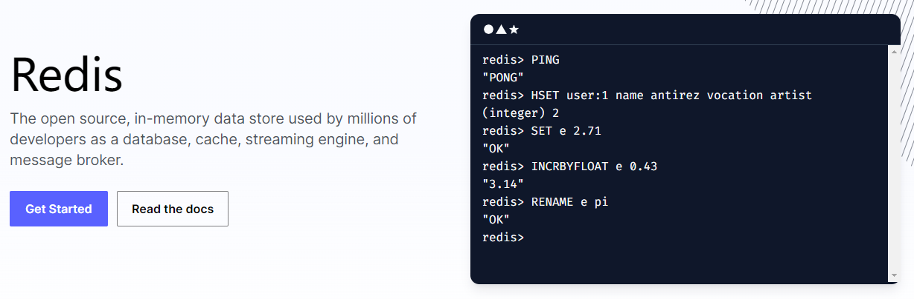
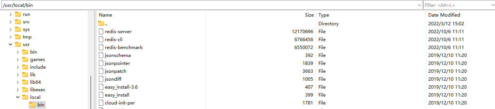
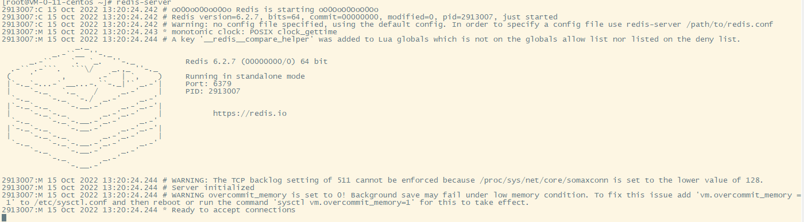

在linux下安装redis，并配置redis后台启动

<!--more-->

## 1 安装redis

### 1.2 下载安装包

首先从官网下载linux上的redis安装包

[下载地址](https://download.redis.io/releases/redis-6.2.7.tar.gz)


### 1.3 安装gcc编译环境

由于redis是c语言开发的，需要依赖gcc编译环境

如何查看是否安装gcc

```shell
gcc -v
```

如果没有gcc，则需要在线安装.命令如下

```shell
yum install -y gcc tcl
```


### 1.4 安装linux

使用客户端工具上传安装包到linux

> 使用终端工具SecureCRT连接服务器
>
> 使用SecureFX传输文件

将安装包上传到`/usr/local/src`目录下

```shell
## 进入安装包目录
cd `/usr/local/src`

## 解压安装包
tar zxvf redis-6.2.7

## 进入文件目录
cd redis-6.2.7

##安装 make是编译，make install是安装
make && make install
```

此时会在`/usr/local/bin`下可以看到redis相关的执行文件，此时redis已经安装完成




## 2 启动redis

### 2.1 启动redis

由于redis-server已经加入环境变量了，所以任意目录下执行`redis-server`即可启动redis服务

下图所示已启动成功




```shell
## 使用ps -ef | grep redis 查看redis是否启动
[root@VM-0-11-centos ~]# ps -ef | grep redis
root     2913007       1  0 13:20 ?        00:00:00 redis-server *:6379
root     2913363 2913292  0 13:22 pts/3    00:00:00 grep --color=auto redis
```

但此时为前台启动，命令执行不会结束，会占用窗口


### 2.2 配置redis后台启动

通过修改配置文件参数，控制redis后台启动

```shell
## 备份文件
[root@VM-0-11-centos redis-6.2.7]# cp /usr/local/src/redis-6.2.7/redis.conf redis.conf.bak

## 编辑文件
[root@VM-0-11-centos redis-6.2.7]# vi /usr/local/src/redis-6.2.7/redis.conf

## vi编辑器操作
## :i编辑
## esc后，:wq保存退出
```

主要关注一下几个配置

```shell
# By default Redis does not run as a daemon. Use 'yes' if you need it.
# Note that Redis will write a pid file in /var/run/redis.pid when daemonized.
# When Redis is supervised by upstart or systemd, this parameter has no impact.
## 后台启动
daemonize yes

#bind 127.0.0.1 -::1
## 启用ip连接
bind 0.0.0.0

# IMPORTANT NOTE: starting with Redis 6 "requirepass" is just a compatibility
# layer on top of the new ACL system. The option effect will be just setting
# the password for the default user. Clients will still authenticate using
# AUTH <password> as usually, or more explicitly with AUTH default <password>
# if they follow the new protocol: both will work.
#
# The requirepass is not compatable with aclfile option and the ACL LOAD
# command, these will cause requirepass to be ignored.
## 配置密码
requirepass 123456

## 记录日志文件
logfile "redis.log"
```

配置完成后使用配置文件启动redis

```shell
[root@VM-0-11-centos redis-6.2.7]# redis-server redis.conf
```


### 2.3 配置redis开机自启动

#### 2.3.1 创建redis服务文件

编写系统服务文件，redis加入到操作系统服务中，加入后就会开机自启动了

```shell
## 创建服务文件
vi /etc/systemd/system/redis.service
```


```shell
## redis服务文件
[Unit]
Description=redis-server
After=network.target

[Service]
Type=forking
## 启动命令
ExecStart=/usr/local/src/redis-server /usr/local/src/redis.conf
PrivateTmp=true

[Install]
WantedBy=multi-user.target
```


#### 2.3.2 通过系统服务启动redis

```shell
## 重新加载系统服务
[root@VM-0-11-centos ~]# systemctl daemon-reload 

## 通过系统服务启动redis服务
[root@VM-0-11-centos ~]# systemctl start redis

## 通过系统服务查看redis服务状态
[root@VM-0-11-centos ~]# systemctl status redis
● redis.service - redis-server
   Loaded: loaded (/etc/systemd/system/redis.service; enabled; vendor preset: disabled)
   Active: active (running) since Sat 2022-10-15 13:45:45 CST; 3s ago
  Process: 2916668 ExecStart=/usr/local/bin/redis-server /usr/local/src/redis-6.2.7/redis.conf (code=exited, status=0/SUCCESS)
 Main PID: 2916669 (redis-server)
    Tasks: 5 (limit: 4988)
   Memory: 10.0M
   CGroup: /system.slice/redis.service
           └─2916669 /usr/local/bin/redis-server 0.0.0.0:6379

Oct 15 13:45:45 VM-0-11-centos systemd[1]: Starting redis-server...
Oct 15 13:45:45 VM-0-11-centos systemd[1]: Started redis-server.

## 通过系统服务停止redis服务
[root@VM-0-11-centos ~]# systemctl stop redis
[root@VM-0-11-centos ~]# systemctl status redis
● redis.service - redis-server
   Loaded: loaded (/etc/systemd/system/redis.service; enabled; vendor preset: disabled)
   Active: inactive (dead) since Sat 2022-10-15 13:46:11 CST; 12s ago
  Process: 2916668 ExecStart=/usr/local/bin/redis-server /usr/local/src/redis-6.2.7/redis.conf (code=exited, status=0/SUCCESS)
 Main PID: 2916669 (code=exited, status=0/SUCCESS)

Oct 15 13:45:45 VM-0-11-centos systemd[1]: Starting redis-server...
Oct 15 13:45:45 VM-0-11-centos systemd[1]: Started redis-server.
Oct 15 13:46:11 VM-0-11-centos systemd[1]: Stopping redis-server...
Oct 15 13:46:11 VM-0-11-centos systemd[1]: redis.service: Succeeded.
Oct 15 13:46:11 VM-0-11-centos systemd[1]: Stopped redis-server.
```

