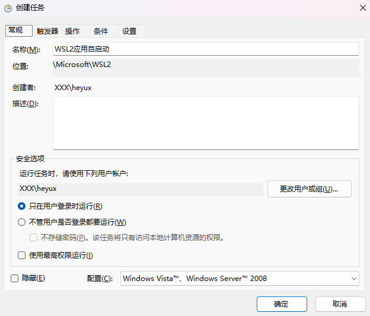
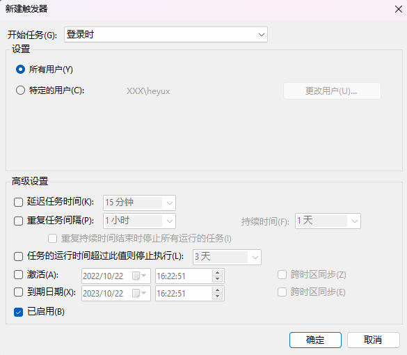
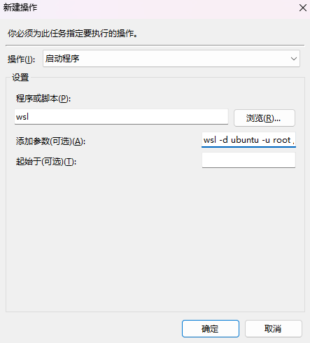

在windows下安装redis，官方推荐通过wsl的方式安装redis。所以需要在windows下配置好wsl。


<!--more-->

[redis官网推荐方式](https://redis.io/docs/getting-started/installation/install-redis-on-windows/)

## 1 安装redis


```shell
sudo apt-get update
sudo apt-get install redis
```

安装完成后在`/usr/bin`目录下会创建`redis-server`等文件，执行`sudo service redis-server start`启动redis服务即可


## 2 wsl下配置redis自启动

### 2.1 方案一

此方案需要wsl版本` 0.67.6+ `在可以，通过`systemd`完成服务的自启动

[wsl官方说明](https://learn.microsoft.com/zh-cn/windows/wsl/wsl-config)

```shell
// 更新wsl版本
wsl --update
// 查看wsl版本
wsl --version

WSL 版本： 0.70.4.0
内核版本： 5.15.68.1
WSLg 版本： 1.0.45
MSRDC 版本： 1.2.3575
Direct3D 版本： 1.606.4
DXCore 版本： 10.0.25131.1002-220531-1700.rs-onecore-base2-hyp
Windows版本： 10.0.22623.870
```


```shell
// 创建wsl.conf 文件开启systemd
sudo cat > /etc/wsl.conf <<EOF
[boot]
systemd=true
EOF
```


### 2.2 方案二

此方案通过`windows计划任务`，在启动时执行`wsl`指令，从而启动`wsl`下相应服务

[参考连接](https://hk.v2ex.com/t/882117)

#### 2.2.1 wsl下新建启动文件

```shell
// 创建启动配置文件
vim /etc/init.ws

// 文件内容
#! /bin/sh
service redis-server start

// 设置文件权限
chmod +x /etc/init.wsl
```


#### 2.2.2 创建计划任务









```shell
// 计划任务操作中添加参数
wsl -d ubuntu -u root /etc/init.wsl
```


```shell
// 设置wsl默认登录用户
Ubuntu.exe config --default-user username
```

